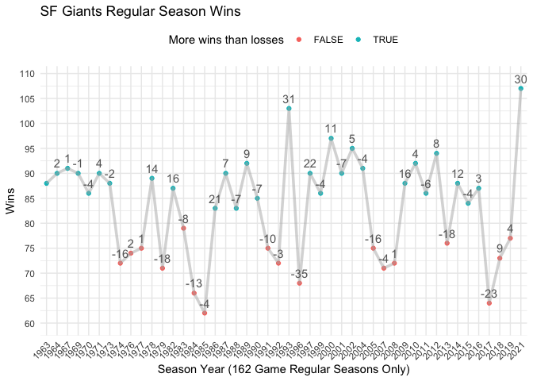
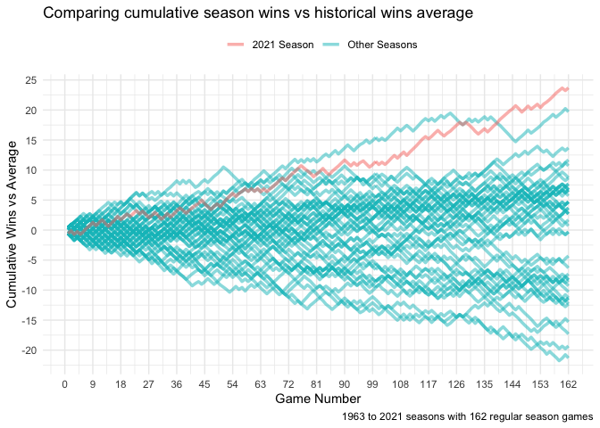
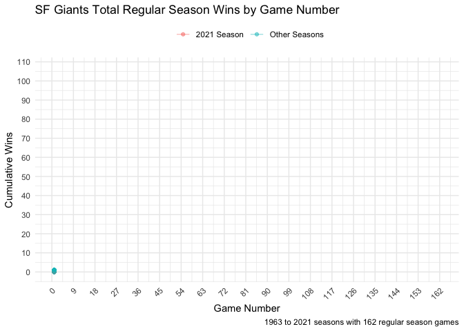

SF Giants 2021 Regular Season Wins
================

### Notebook objective

  - Use data visualizations to explore SF Giants franchise record of 107
    wins during the 2021 regular season.

### Packages

``` r
required_packages <- c('tidyverse', 'gganimate', 'rvest', 'transformr',
                       'gifski', 'png')

for(p in required_packages) {
  library(p,character.only = TRUE)
}
```

### Collect SF Giants wins by season data

``` r
### get giants regular season data from baseball reference site
url <- "https://www.baseball-reference.com/teams/SFG/#franchise_years"
sfg_season_stats_html_table <- read_html(url)
sfg_season_data <- data.frame(html_table(sfg_season_stats_html_table))

### only seasons with 162 games 
sfg_season_data <- sfg_season_data %>%
      janitor::clean_names() %>%
      as_tibble() %>%
      filter(g==162)
```

### Visualize wins by season

  - 2021 most wins in a regular season
  - 2021 second most improvement from prior season with 162 games (30
    more wins than 2019 season)

<!-- end list -->

``` r
sfg_season_data %>%
      arrange(year) %>%
      mutate(winning_season = w>l,
             wins_delta_from_previous_162_game_season = w - lag(w),
             more_wins_than_prior_162_game_season =                  
                   wins_delta_from_previous_162_game_season>0) %>%
      ggplot(aes(x=factor(year),
                 y=w,
                 color=winning_season,
                 group=1)) +
      geom_point() +
      geom_line(color="grey70", alpha=0.5, size=1.25) +
      geom_text(aes(label=wins_delta_from_previous_162_game_season), 
                vjust=-0.7, show.legend = F, color="grey40") +
      scale_y_continuous(breaks=seq(0,200,5),
            expand = expansion(mult = c(0.1, 0.1))) +
      theme_minimal() +
      theme(axis.text.x = element_text(angle = 45, hjust = 1, vjust = 1),
            legend.position = "top") +
      labs(title="SF Giants Regular Season Wins",
           x="Season Year (162 Game Regular Seasons Only)",
           y="Wins",
           color="More wins than losses")
```

<!-- -->

### By season collect cumulative wins by game number

``` r
years <- sfg_season_data %>% pull(year)

pull_sfg_by_game_season_stats <- function(year) {
      url <- paste0("https://www.baseball-reference.com/teams/SFG/",
                    year,
                    "-schedule-scores.shtml#team_schedule")
      season_results <- read_html(url)
      data.frame(html_table(season_results)) %>%
            filter(Gm. %in% c(1:162)) %>%
            rowwise() %>%
            mutate(year = year,
                   wins = as.numeric(strsplit(W.L.1, "-")[[1]][1]))
}

sfg_by_game_season_stats <- map_df(years, ~pull_sfg_by_game_season_stats(.))
```

### Comparing season progress vs average wins by game number

  - Strong finish to 2021 season propelled the SF Giants to 2021
    franchise record.

<!-- end list -->

``` r
wins_vs_avg <- sfg_by_game_season_stats %>%
    mutate(game_number = as.numeric(Gm.),
           best_season = ifelse(year==2021, "2021 Season", 
                          "Other Seasons")) %>%
    group_by(game_number) %>%
    mutate(avg_wins_game_number = mean(wins)) %>%
    rowwise() %>%
    mutate(wins_vs_average = wins - avg_wins_game_number)

wins_vs_avg %>% 
  ggplot(aes(y=wins_vs_average,
             x=game_number,
             color=best_season,
             group=year)) +
  geom_line(alpha=0.5, size=1.25) +
  scale_y_continuous(breaks=seq(-30,30,5)) +
  scale_x_continuous(breaks=seq(0,162,9)) +
  theme_minimal() +
  theme(legend.position = "top") +
  labs(title="Comparing cumulative season wins vs historical wins average",
       x="Game Number",
       y="Cumulative Wins vs Average",
       caption = "1963 to 2021 seasons with 162 regular season games",
       color="")
```

<!-- -->

### Visualizing SF Giants 2021 franchise: 107 regular season wins

  - Animated chart is another angle for showing the strong finish to the
    season.
  - Pressure from LAD (who won 106 games in 2021) to win the NL West
    division likely helped push the Giants team at the end.

<!-- end list -->

``` r
sfg_by_game_season_stats %>%
  mutate(game_number = as.numeric(Gm.),
         best_season = ifelse(year==2021, "2021 Season", 
                          "Other Seasons")) %>%
  ggplot(aes(x=game_number,
             y=wins,
             group=year,
             color=best_season)) +
  geom_point(alpha=0.5) +
  geom_line(alpha=0.4) +
  theme_minimal() +
  scale_y_continuous(breaks=seq(0,110,10)) +
  scale_x_continuous(breaks=seq(0,162,9)) +
  theme(axis.text.x = element_text(angle = 45, hjust = 1, vjust = 1),
        legend.position = "top") +
  labs(title="SF Giants Total Regular Season Wins by Game Number",
       caption = "1963 to 2021 seasons with 162 regular season games",
       x="Game Number",
       y="Cumulative Wins",
       color="") + 
  gganimate::transition_reveal(game_number)
```

<!-- -->
